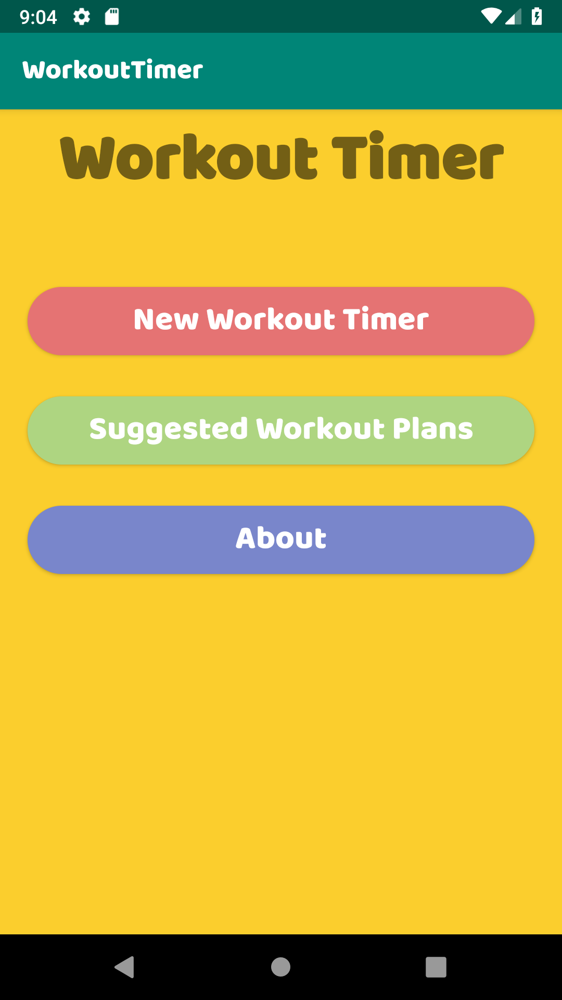

# WorkoutTimerPreview

Preview of the Workout Timer Android App that lets you create a circuit of exercises and will play a sound notifying you when it is time to move onto the next exercise.

Published on the Google Play Store [(Google Play Store Link)](https://play.google.com/store/apps/details?id=com.cliveke.workouttimer)

 
